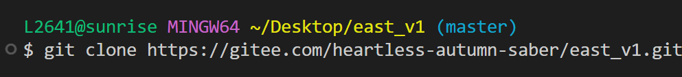
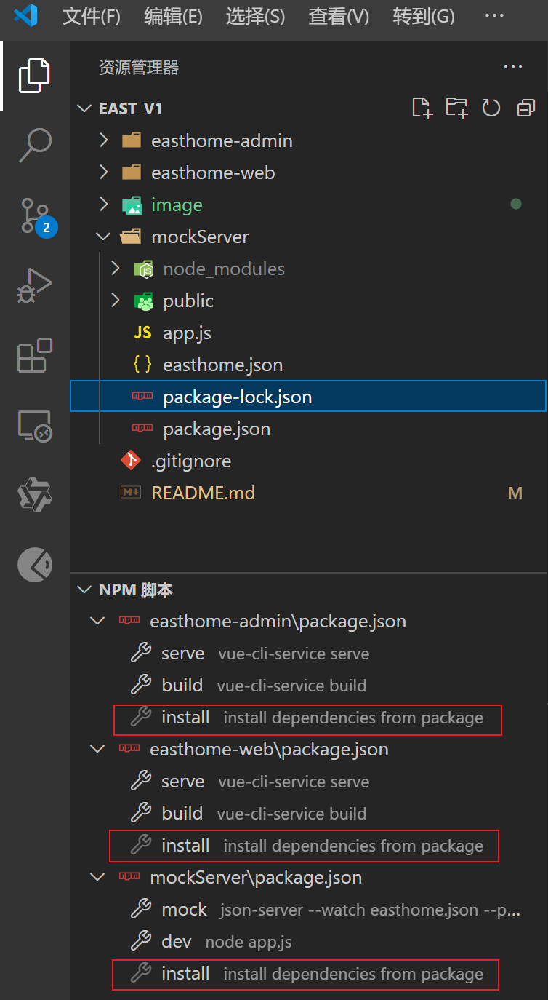
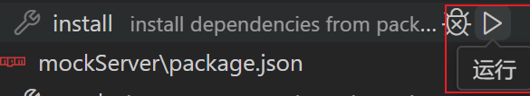

# east_v1

#### 介绍

东方瑞通前端项目是一个基于Vuejs框架开发的公司官方网站。系统包含选课中心、企业培训、考试认证等几个模块。

#### 软件架构

基于Vue前端框架

#### 安装教程

1. 在终端(如cmd,gitbush,powershell等)执行"git clone https://gitee.com/heartless-autumn-saber/east_v1.git"

   
2. 在vscode打开刚才clone到本地的文件夹，点击任意文件夹内的 package.json 文件，在左边侧边栏会出现NPM脚本选项栏，运行install脚本来安装依赖

   

   
3. 依赖安装好后，先运行NPM脚本内的dev，mock脚本，再运行admin端和web端的server脚本，如果运行正常，系统会自动跳转浏览器打开网页

#### 使用说明

1. mockServer中的mock脚本用来执行json-server服务，该服务能够存储数据，充当该项目的后端数据库
2. mockServer中的dev脚本用来实现文件的上传，如照片视频等，使存储的数据不再局限于json格式
3. 在admin端和web端的使用请自行探索

#### 参与贡献

1. Fork 本仓库
2. 新建 Feat_xxx 分支
3. 提交代码
4. 新建 Pull Request
